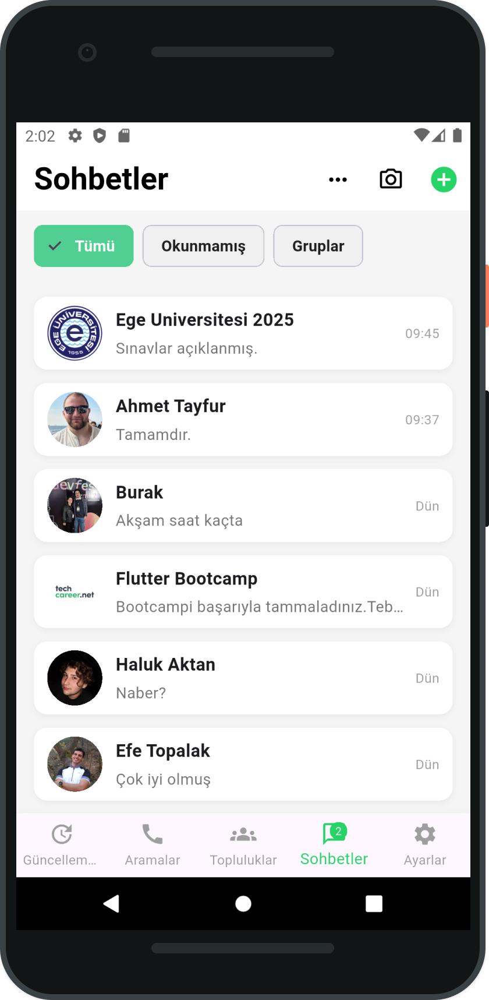

# 📱 WhatsApp Clone (Flutter)

Bu proje, [techcareer.net](https://techcareer.net) tarafından düzenlenen **Flutter Bootcamp** kapsamında geliştirdiğim ödev projesidir.

Flutter kullanılarak hazırlanmış bu mobil uygulama arayüzü, WhatsApp'ın sohbet ekranı tasarımını klonlayarak mobil UI geliştirme pratiği sunmayı amaçlar.

---

## ✨ Özellikler

- 📱 WhatsApp tarzı sohbet listesi arayüzü  
- 🔘 Filtre sekmeleri: Tümü, Okunmamış, Gruplar, Favoriler  
- 📂 Alt navigasyon çubuğu (BottomNavigationBar)  
- 🖼️ Gerçek avatar desteği (hem URL hem lokal .png dosyası)  
- ⚙️ Modüler Flutter dosya yapısı (widgets, models, pages)

---

## 📸 Uygulama Ekran Görüntüsü

  

---

## 🚀 Kullanılan Teknolojiler

- Flutter 3.x  
- Dart  
- Git & GitHub  
- VS Code

---

## 🧑‍💻 Geliştirici

**Ahmet Tayfur**  
[GitHub Profilim](https://github.com/svactrion)  
[LinkedIn Profilim](https://www.linkedin.com/in/ahmet-tayfur-53641018b/)

Mail => aet78@outlook.com
